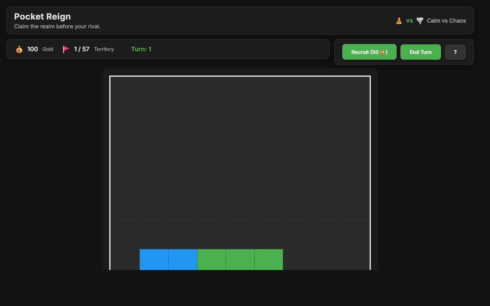
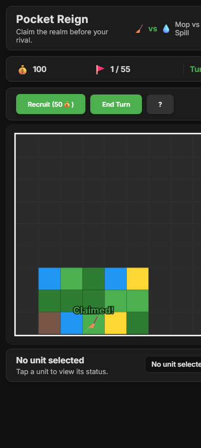
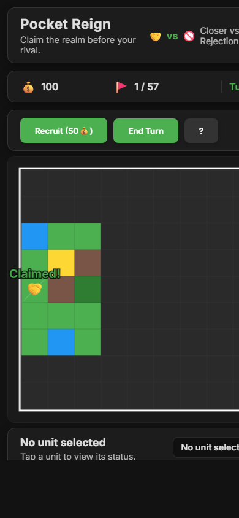

# Pocket Reign

Pocket Reign is a minimalist 4X-inspired browser game where you race an opposing faction to claim a procedurally generated map. Move warriors across tiles, capture territory, and reach 50% map control to win.

## Play Now
- **Web:** [Pocket Reign Demo](https://scahyono.github.io/pocket-reign/index.html)

### Install as a PWA on Android Chrome
1. Open the link above in Chrome on Android.
2. Tap the **⋮** menu and choose **Add to Home screen**.
3. Launch Pocket Reign from your home screen for a fullscreen, standalone experience.

## How to Play
- **Win Condition:** Control **50%** of the land before your rival does.
- **Move & Claim:** Select a unit and click an adjacent tile to move; entering a tile automatically claims it.
- **Recruit:** Spend **50 Gold** to recruit a Warrior from your capital using the **Recruit Warrior** button.
- **End Turn:** Press **End Turn** after issuing your moves to advance the round.
- **Factions:** Each match randomly pairs your faction with a rival; icons in the HUD show the matchup.

## Terrain Legend
- 🌿 **Grass:** Movement cost **1**.
- 🌲 **Forest:** Movement cost **2**.
- 🏜️ **Desert:** Movement cost **1**.
- ⛰️ **Mountain:** Impassable (blocked).
- 🌊 **Water:** Impassable (blocked).
- 🟩 **Your Territory:** Tiles you control.
- 🟥 **Enemy Territory:** Tiles the rival controls.

## Tips
- Expand early on cheap terrain like Grass and Desert to maximize coverage.
- Avoid bottlenecks of Mountains and Water when plotting paths.
- Track Gold in the top bar to time new Warrior recruits for critical pushes.
- Keep an eye on the turn counter to pace your expansion against the AI.

## Tech Stack
- HTML5 Canvas for rendering
- Vanilla JavaScript for gameplay logic
- CSS for UI styling

## Screenshots

### Web

### Mobile
| Android | iPhone |
|:-------:|:------:|
|  |  |

